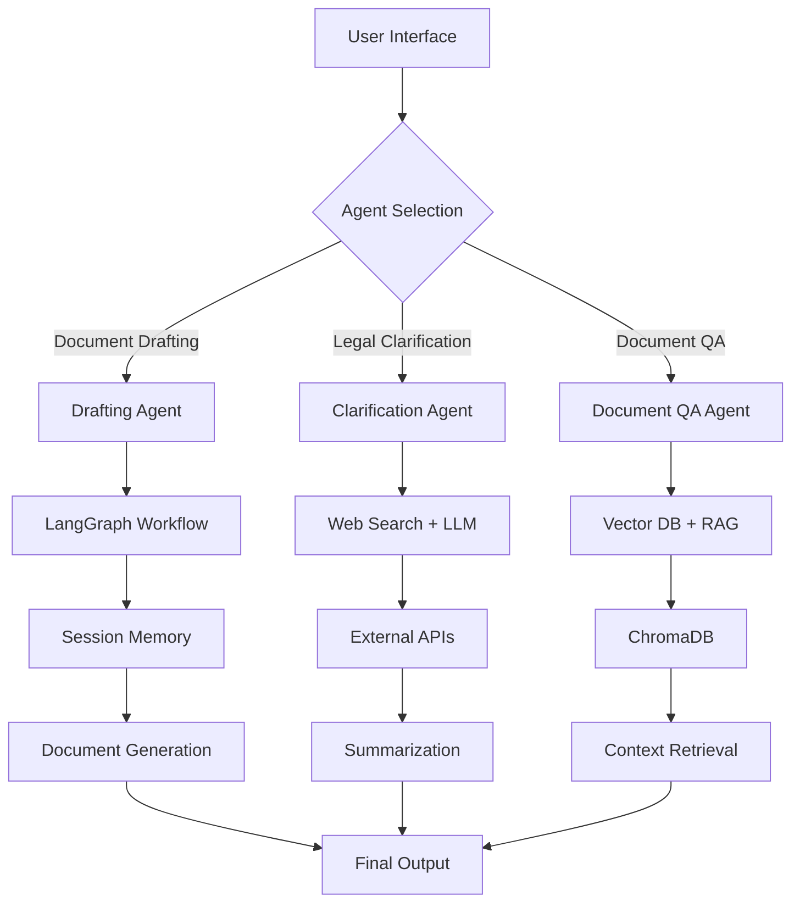

# Legal Product Suite: Agentic AI with Memory for Document Drafting, Clarification, and Document-Based QA

[](LICENSE)
[](https://python.org)
[](https://streamlit.io)

## 🎯 Project Overview

The **Legal Product Suite** is a comprehensive conversational AI assistant designed to revolutionize legal document processing and research. This multi-functional platform integrates three powerful agents into a single, unified interface to serve legal professionals, students, and individuals requiring legal assistance.

### 🚀 Key Features

- **🤖 Conversational Legal Document Drafting**: Interactive document creation with intelligent follow-up questions
- **🔍 Real-time Legal Clarification**: Fetch and summarize legal information from trusted sources
- **📄 Document-Based Q&A**: Upload legal documents and ask context-specific questions using RAG (Retrieval-Augmented Generation)

## 📋 Table of Contents

- [Architecture Overview](#architecture-overview)
- [Agent Modules](#agent-modules)
- [Technology Stack](#technology-stack)
- [Installation & Setup](#installation--setup)
- [Usage Guide](#usage-guide)
- [API Documentation](#api-documentation)
- [Development Guidelines](#development-guidelines)
- [Deployment](#deployment)
- [Contributing](#contributing)
- [License](#license)

## 🏗️ Architecture Overview

The system follows a modular, agent-based architecture where each agent operates independently while sharing common infrastructure:

```
Legal Product Suite
├── 🤖 Drafting Agent (drafting/)
├── 🔍 Clarification Agent (clarification/)
├── 📄 Document QA Agent (document_qa/)
├── 🎨 Unified UI (streamlit_app.py)
├── 🛠️ Common Utilities (utils/)
└── 📊 Shared Memory & Storage
```

### System Flow Diagram



## 🤖 Agent Modules

### 1. Drafting Agent (`drafting/`)

**Purpose**: Interactively draft legal documents through conversational workflows.

**Key Features**:
- Supports multiple document types (NDA, Contracts, Lease Agreements)
- Intelligent information collection with follow-up questions
- Session-based memory management
- Template-driven document generation

**LangGraph Workflow**:
- `identify_document` → `ask_question` → `process_answer` → `generate_document`
- Error handling and fallback mechanisms
- Conditional transitions based on workflow state

**Supported Document Types**:
- Non-Disclosure Agreement (NDA)
- Service/Employment/Sales Contracts
- Residential/Commercial Lease Agreements

### 2. Clarification Agent (`clarification/`)

**Purpose**: Provide real-time legal clarifications from trusted sources.

**Key Features**:
- Keyword extraction from legal queries
- Web search focusing on legal sources (CanLII, justice.gc.ca)
- Multi-LLM architecture with fallback
- Source citation and summarization

**LangGraph Workflow**:
- `extract_keywords` → `search_web` → `validate_results` → `summarize`
- Fallback logic for robust performance
- Canadian law focus with international adaptability

### 3. Document-Based QA Agent (`document_qa/`)

**Purpose**: Answer context-specific questions from uploaded legal documents.

**Key Features**:
- Multi-format support (PDF, DOCX, TXT)
- Vector embeddings with ChromaDB storage
- Retrieval-Augmented Generation (RAG)
- Persistent document storage

**Processing Pipeline**:
- Document upload → Text extraction → Chunking → Embedding → Storage
- Query processing → Vector search → Context retrieval → Answer generation

## 🛠️ Technology Stack

### Core Technologies
- **Python 3.8+**: Primary programming language
- **LangGraph**: Workflow orchestration and agent management
- **Streamlit**: Web-based user interface
- **ChromaDB**: Vector database for document embeddings

### LLM Integration
- **Primary LLMs**: 
  - Groq (Llama3-70B, Qwen-QWQ-32B)
  - Gemini (Gemini-Pro, Gemini-2.5-Flash)
- **Embeddings**: HuggingFace Transformers
- **Fallback Architecture**: Multi-provider redundancy

### External APIs & Tools
- **DuckDuckGoSearchRun**: Web search capabilities
- **LangChain**: Prompt engineering and document processing
- **PyPDF2/python-docx**: Document parsing

### Free-Tier Compliance
✅ All components use free-tier or open-source solutions
✅ No paid APIs or premium services required
✅ Deployable on free cloud platforms

## 📦 Installation & Setup

### Prerequisites

```bash
# Python 3.8 or higher
python --version

# Git (for cloning)
git --version
```

### Quick Start

1. **Clone the Repository**
```bash
git clone https://github.com/your-username/legal-ai-suite.git
cd legal-ai-suite
```

2. **Create Virtual Environment**
```bash
python -m venv legal_ai_env
source legal_ai_env/bin/activate  # On Windows: legal_ai_env\Scripts\activate
```

3. **Install Dependencies**
```bash
pip install -r requirements.txt
```

4. **Environment Configuration**
```bash
cp .env.example .env
# Edit .env with your API keys
```

5. **Initialize Databases**
```bash
python setup.py init_db
```

6. **Run the Application**
```bash
streamlit run streamlit_app.py
```

### Environment Variables

Create a `.env` file with the following variables:

```env
# LLM API Keys (Free Tier)
GROQ_API_KEY=your_groq_api_key
GEMINI_API_KEY=your_gemini_api_key
HUGGINGFACE_API_TOKEN=your_hf_token

# Database Configuration
CHROMA_DB_PATH=./chroma_db
SESSION_STORE_PATH=./sessions

# Application Settings
DEBUG=True
LOG_LEVEL=INFO
```

## 📖 Usage Guide

### Starting the Application

1. Launch the Streamlit interface:
```bash
streamlit run streamlit_app.py
```

2. Navigate to `http://localhost:8501` in your browser

3. Select an agent from the sidebar:
   - **Document Drafting**: Create legal documents
   - **Legal Clarification**: Get real-time legal answers
   - **Document QA**: Upload and query documents

### Document Drafting Workflow

1. **Select Document Type**: Choose from NDA, Contract, or Lease Agreement
2. **Provide Initial Information**: Describe your requirements
3. **Answer Follow-up Questions**: The agent will ask for missing details
4. **Review Generated Document**: Examine the complete legal document
5. **Download/Export**: Save the document in your preferred format

### Legal Clarification Usage

1. **Ask Legal Questions**: Enter queries like "What is the difference between void and voidable contracts in Canada?"
2. **Keyword Processing**: The system extracts relevant legal terms
3. **Source Search**: Searches trusted legal databases
4. **Receive Summarized Answer**: Get concise, cited responses

### Document QA Process

1. **Upload Documents**: Support for PDF, DOCX, and TXT files
2. **Document Processing**: Automatic text extraction and chunking
3. **Ask Questions**: Query specific aspects of your documents
4. **Contextual Answers**: Receive answers grounded in your uploaded content

## 🔧 API Documentation

### Core Agent APIs

#### Drafting Agent API

```python
from drafting import DraftingAgent

agent = DraftingAgent()

# Start drafting session
session_id = agent.start_session(
    document_type="nda",
    user_input="I need an NDA for my tech startup"
)

# Process conversation
response = agent.process_message(
    session_id=session_id,
    message="The other party is ABC Corp"
)

# Generate final document
document = agent.generate_document(session_id)
```

#### Clarification Agent API

```python
from clarification import ClarificationAgent

agent = ClarificationAgent()

# Get legal clarification
result = agent.get_clarification(
    query="What is consideration in contract law?"
)

print(result.summary)
print(result.sources)
```

#### Document QA Agent API

```python
from document_qa import DocumentQAAgent

agent = DocumentQAAgent()

# Upload and process document
doc_id = agent.upload_document(
    file_path="contract.pdf",
    document_type="contract"
)

# Ask questions
answer = agent.ask_question(
    doc_id=doc_id,
    question="What are the termination clauses?"
)
```

### REST API Endpoints

The application also exposes REST endpoints:

```http
POST /api/v1/drafting/start
POST /api/v1/drafting/message
GET  /api/v1/drafting/document/{session_id}

POST /api/v1/clarification/query
GET  /api/v1/clarification/sources

POST /api/v1/document-qa/upload
POST /api/v1/document-qa/query
GET  /api/v1/document-qa/documents
```

## 🧪 Development Guidelines

### Project Structure

```
legal-ai-suite/
├── agents/
│   ├── drafting/
│   │   ├── graph.py          # LangGraph workflow
│   │   ├── memory.py         # Session management
│   │   └── prompt_templates.py
│   ├── clarification/
│   │   ├── graphSearch.py    # Search workflow
│   │   └── summarize.py      # LLM summarization
│   └── document_qa/
│       ├── graphRag.py       # RAG pipeline
│       └── vector_store.py   # ChromaDB management
├── app.py
           # UI components

```

### Coding Conventions

- **PEP 8**: Follow Python style guidelines
- **Type Hints**: Use type annotations for all functions
- **Docstrings**: Google-style docstrings for all modules
- **Error Handling**: Comprehensive exception handling
- **Logging**: Structured logging throughout the application

### Testing Strategy

```bash
# Run unit tests
pytest tests/unit/

# Run integration tests
pytest tests/integration/

# Run with coverage
pytest --cov=agents tests/
```

### Adding New Document Types

1. **Create Template**: Add to `agents/drafting/prompt_templates.py`
2. **Define Questions**: Specify required information fields
3. **Update Workflow**: Modify `graph.py` to handle new type
4. **Add Tests**: Create comprehensive test cases


### Agent Development

To add a new agent:

1. **Create Agent Directory**: `agents/your_agent/`
2. **Implement LangGraph Workflow**: Define nodes and edges
3. **Add Memory Management**: Implement session handling
4. **Create UI Components**: Integrate with Streamlit interface
5. **Write Tests**: Unit and integration tests
6. **Update Documentation**: Add to README and API docs

## 🔒 Security & Privacy

### Data Protection

- **No Data Persistence**: User data not stored permanently
- **Session Isolation**: Each session is independent
- **API Key Security**: Environment variable protection
- **Input Sanitization**: All user inputs are validated

### Legal Compliance

- **Disclaimer**: AI-generated content requires legal review
- **Jurisdiction Awareness**: Specify applicable law regions
- **Professional Advice**: Recommend consultation with lawyers
- **Liability Limitations**: Clear usage terms and conditions


---

**⚠️ Legal Disclaimer**: This tool is designed to assist with legal document drafting and research but does not constitute legal advice. Users should consult with qualified legal professionals for important legal matters. The generated documents and information should be reviewed by a licensed attorney before use.

**🏗️ Development Status**: This project is actively maintained and under continuous development. Contributions and feedback are welcome!

---

*Last Updated: July 2025*
*Version: 1.0.0*